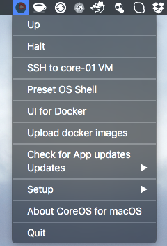

CoreOS VM for macOS
========================

**CoreOS VM** is masOS `status bar app` which allows in an easy way to control CoreOS VM on your Mac. 

It leverages macOS native Hypervisor framework of using [xhyve](https://github.com/xhyve-xyz/xhyve) based [corectl](https://github.com/TheNewNormal/corectl) command line tool without any needs to use VirtualBox or similar virtualisation software.

**New:** After successful install you can control CoreOS VM via `corevm` cli as well. Cli resides in `~/coreos-osx/bin` folder and has simple commands: `corevm start|stop|status|ip`. Just copy the `corevm` to your pre-set path and you are good to control Vm via cli, it is specially handy for automation tasks.

The best use case of this App is to allow to build/test [Docker](https://www.docker.com) and [rkt](https://coreos.com/rkt/) images localy.
You can push your Docker images to [Docker Registry](https://github.com/docker/distribution) on `192.168.64.1:5000` run by [Corectl App](https://github.com/TheNewNormal/corectl.app), to store
your Docker images and share with Kubernetes Apps for macOS: [Kube-solo](https://github.com/TheNewNormal/kube-solo-osx) and [Kube-Cluster](https://github.com/TheNewNormal/kube-cluster-osx)




How to install CoreOS VM for macOS
----------

**Requirements**
 -----------
  - **macOS 10.10.3** Yosemite or later 
  - Mac 2010 or later for this to work
  - [Corectl App](https://github.com/TheNewNormal/corectl.app) is installed, which will serve as `corectld` server daemon control.


####Install:
- Download [Corectl App](https://github.com/TheNewNormal/corectl.app) `latest dmg` from the [Releases Page](https://github.com/TheNewNormal/corectl.app/releases) and install it to `/Applications` folder, it allows to start/stop/update [corectl](https://github.com/TheNewNormal/corectl) tools needed to run CoreOS VMs on macOS
- Download `CoreOS latest.dmg` from the [Releases Page](https://github.com/TheNewNormal/coreos-osx/releases). Open downloaded `dmg` file and drag the App e.g. to your Desktop. Start the `CoreOS` app and `Initial setup` will beggin.

**TL;DR**

- App's files are installed to `~/coreos-osx` folder
- CoreOS ISO files are stored under `~/.coreos/images` folder
- Mac user home folder can be enabled via `Setup\Enable shared NFS user home folder` to automaticly mounted to VM: `/Users/my_user`:`/Users/my_user` on each VM boot
- macOS `docker` client is installed to `~/coreos-osx/bin` and preset in `OS shell` to be used from there


**The install will do the following:**

- All dependent files/folders will be put under `coreos-osx` folder in the user's home folder e.g `/Users/someuser/coreos-osx`
- ISO images are stored under `~/.coreos/images`
That allows to share the same images between different `corectl` based Apps and also speeds up this App VMs reinstall
- user-data file will have Docker Socket for the API enabled
- Will download latest CoreOS ISO image and run `corectl` to initialise VM with docker 2375 port pre-set for docker macOS client
- Will download and install `docker` macOS client to `~/coreos-osx/bin/`
- A small shell script `rkt` will be installed to `~/coreos-osx/bin/` which allows to call via ssh remote `rkt` binary on CoreOS VM
- A small shell script `etcdctl` will be installed to `~/coreos-osx/bin/` which allows to call via ssh remote `etcdctl` binary on CoreOS VM
- `docker-exec` script (docker exec -it $1 bash -c 'export TERM=xterm && bash') will be installed 
 into `~/coreos-osx/bin/` too, which allows to enter container with just a simple command:
 docker-exec container_name 
- Also `docker2aci` binary will be installed to `~/coreos-osx/bin/`, which allows to convert docker images to `rkt` aci images
- Will install [UI for Docker](https://github.com/kevana/ui-for-docker) via unit files
- Via assigned static IP (it will be shown in first boot and will survive VM's reboots) you can access any port on CoreOS VM
- user-data file enables docker flag `--insecure-registry` to access insecure registries.
- Persistent sparse disk (QCow2) `data.img` will be created and mounted to `/data` for these mount binds:

```
/data/var/lib/docker -> /var/lib/docker
/data/var/lib/rkt -> /var/lib/rkt
/data/var/lib/etcd2 -> /var/lib/etcd2
/data/opt/bin -> /opt/bin
```


How it works
------------

Just start `CoreOS OSX` application and you will find a small icon with the CoreOS logo in the Status Bar.

* There you can `Up` and `Halt` CoreOS VM
* `SSH to core-01` will open VM shell
* Under `Up` OS Shell will be opened when VM boot finishes up and it will have such environment pre-set:

```
DOCKER_HOST=tcp://192.168.64.xxx:2375
ETCDCTL_PEERS=http://192.168.64.xxx:2379
```
```
Path to `~/coreos-osx/bin` where docker binary, rkt, etcdclt 
and docker-exec shell scripts are stored
```

* `OS Shell` opens OS Shell with the same enviroment preset as `Up`
* `Updates/Check for update of docker macOS client` will update fleet and docker macOS clients to the same versions as CoreOS VM runs.
* [UI for Docker](https://github.com/kevana/ui-for-docker) will show up all running containers and etc
* You can upload your saved/exported docker images place in `~/coreos-osx/docker_images` folder via `Upload docker images`
* Persistent sparse disk `data.img` will be created and mounted to `/data` to these mount binds (data persists between reboots):

```
/data/var/lib/docker -> /var/lib/docker
/data/var/lib/rkt -> /var/lib/rkt
/data/var/lib/etcd2 -> /var/lib/etcd2
/data/opt/bin -> /opt/bin
```

### have fun!

Credits
-----------
* To [António Meireles](https://github.com/AntonioMeireles) for his awesome [corectl](https://github.com/TheNewNormal/corectl) tool to easily control [xhyve](https://github.com/xhyve-xyz/xhyve)
* To [Michael Steil](https://github.com/mist64) for the awesome [xhyve](https://github.com/mist64/xhyve) lightweight macOS virtualization solution
* To Kelsey Hightower for [Docker Registry macOS Setup Guide](https://github.com/kelseyhightower/docker-registry-osx-setup-guide).


Other CoreOS VM based Apps for macOS
-----------
* Cluster one CoreOS VM App can be found here [CoreOS Cluster for macOS](https://github.com/rimusz/coreos-osx-cluster).
* Kubernetes Solo Cluster VM App (corectl based) can be found here [Kube Solo for macOS](https://github.com/TheNewNormal/kube-solo-osx).
* Kubernetes Cluster one CoreOS VM App can be found here [CoreOS Kubernetes Cluster for macOS ](https://github.com/rimusz/coreos-osx-kubernetes-cluster).

## Contributing

**CoreOS VM** is an [open source](http://opensource.org/osd) project release under
the [Apache License, Version 2.0](http://opensource.org/licenses/Apache-2.0),
hence contributions and suggestions are gladly welcomed! 
